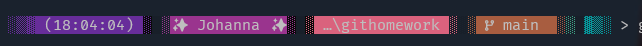
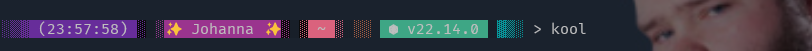

# githomework

- It is friday.
- It is saturday and this my WIP bash prompt
- It is sunday funday!

- What day is it
- How is it thursday already
- Friday
- Monday, Tuesday
- AAAAAAAAAAAAAAAAAAAA
- AAAAAAAAAAAAAAAAAAA
- AAAAAAAAAAAAAAAAAA
- AAAAAAAAAAAAAAAAA
- AAAAAAAAAAAAAAAA
- AAAAAAAAAAAAAAA
- AAAAAAAAAAAAAA
- AAAAAAAAAAAAA
- AAAAAAAAAAAA
- AAAAAAAAAAA
  

